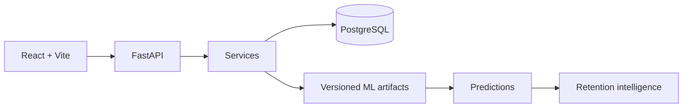

# Architecture

```mermaid
flowchart LR
  UI[React + Vite] --> API[FastAPI]
  API --> S[Services]
  S --> DB[(PostgreSQL)]
  S --> ML[Versioned ML artifacts]
  ML --> P[Predictions]
  P --> R[Retention intelligence]
```

The application separates API routes, services, SQLAlchemy models, data pipeline modules, and frontend API clients. Authentication is planned but not implemented.
